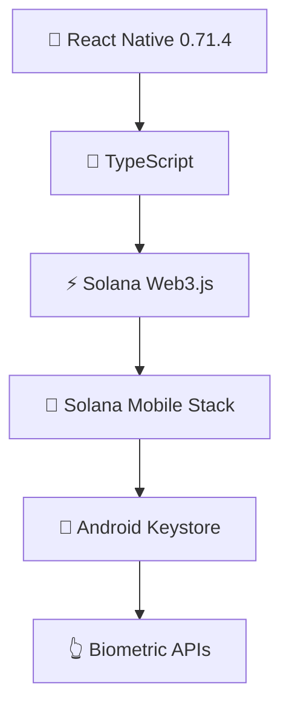
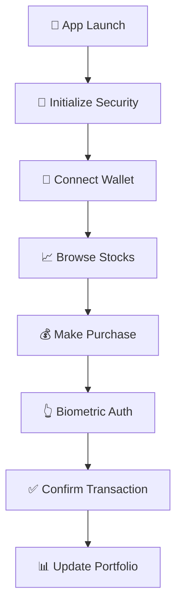

<div align="center">

# 🌟 Sol Stocks Mobile 🌟


### 📱 The Future of Mobile Stock Trading on Solana 🚀

*Trade stocks with SOL & BONK • Hardware-backed security • Mobile-first experience*

</div>

---

## ✨ Features

<table>
<tr>
<td width="50%">

### 🚀 **Solana Mobile Stack**
```
✅ Mobile Wallet Adapter (MWA)
✅ Seed Vault Integration  
✅ Solana Pay Support
✅ dApp Store Ready
```

### 🔒 **Security First**  
```
🔐 Hardware-backed Keys
👆 Biometric Authentication
🛡️  Device Security Validation
🔒 Encrypted Transactions
```

</td>
<td width="50%">

### 📱 **Mobile Trading**
```
📈 Real-time Portfolio
💹 Professional Interface
🎯 Mobile-optimized UX
⚡ Lightning Fast
```

### 💰 **Multi-Token Support**
```
◎ SOL Primary Payment
🐕 BONK Alternative  
💸 Dynamic Fee Structure
💰 Treasury Collection
```

</td>
</tr>
</table>

---

## 📊 **Stock Categories & Fees**

<div align="center">

| Category | Examples | Buy Fee | Sell Fee |
|:--------:|:---------|:-------:|:--------:|
| 🏢 **Traditional** | AAPL, GOOGL, MSFT, TSLA | `0.25%` | `0.35%` |
| 🚀 **Crypto** | COIN, MSTR, RIOT, VANA | `0.35%` | `0.45%` |
| 💎 **Premium** | CIRCLE, GEMINI, KRAKEN | `0.50%` | `0.60%` |

</div>

## 🏗️ **Technical Architecture**

<div align="center">

### 🛠️ **Core Tech Stack**



</div>

| Technology | Version | Purpose |
|:-----------|:--------|:--------|
| 📱 **React Native** | `0.71.4` | Cross-platform mobile framework |
| 🔷 **TypeScript** | `4.9.4` | Type-safe development |
| ⚡ **Solana Web3.js** | `1.98.2` | Blockchain interaction |
| 📲 **Mobile Stack SDK** | `2.2.2` | Native wallet integration |

---

## 🔧 **Key Components**

<div align="center">

### 📲 **Mobile Wallet Adapter** • `src/utils/mobileWalletAdapter.ts`
```
🔗 Native wallet connection management
✍️  Transaction signing and sending  
💰 Balance checking and airdrop functionality
⚠️  Error handling and connection status management
```

### 🔐 **Seed Vault** • `src/utils/seedVault.ts`  
```
🏗️  Hardware-backed secure key generation and storage
👆 Biometric authentication integration
🔒 Encrypted seed management
🛡️  Device security validation
```

### 💳 **Solana Pay Integration** • `src/utils/solanaPayIntegration.ts`
```
🔗 Payment URL generation for stock purchases
✅ Transaction creation and confirmation
💸 Fee calculation and treasury management
📊 Payment history tracking
```

### 📱 **Trading Interface** • `src/components/`
```
📈 MobileStockListing: Stock browsing and purchasing interface
💼 MobilePortfolio: Portfolio management and trading history  
⚡ Real-time price updates and P&L calculations
🎯 Mobile-optimized user experience
```

</div>

---

## 🤖 **Android Integration**

<table>
<tr>
<td width="50%">

### 📋 **AndroidManifest.xml Configuration**
```
📲 Solana Mobile Stack permissions and features
👆 Biometric authentication capabilities  
🔗 Deep linking for Solana Pay
🏪 dApp Store metadata
```

</td>
<td width="50%">

### 🛡️ **Security Features**
```
🔐 Hardware security module integration
👆 Biometric authentication (fingerprint, face recognition)
✍️  Secure transaction signing
🌐 Network security configuration
```

</td>
</tr>
</table>

---

## 🛠️ **Development Setup**

<div align="center">

### 📋 **Prerequisites**

| Requirement | Version | Purpose |
|:------------|:--------|:--------|
| 📗 **Node.js** | `16+` | JavaScript runtime |
| 📦 **npm/yarn** | `latest` | Package management |
| ⚛️ **React Native CLI** | `latest` | Mobile development |
| 🤖 **Android Studio** | `latest` | Android development |
| 📱 **Saga Phone** | `recommended` | Solana Mobile Stack testing |

</div>

### 🚀 **Installation**

#### **1️⃣ Clone and Install Dependencies**
```bash
# Clone the repository
git clone https://github.com/solstocks/sol-stocks-mobile.git
cd SolStocksMobile

# Install packages
npm install
```

#### **2️⃣ Android Setup**
```bash
# Clean and build Android
cd android
./gradlew clean
cd ..

# Run on Android device
npx react-native run-android
```

#### **3️⃣ Start Metro Bundler**
```bash
# Start development server
npx react-native start
```

---

## ⚙️ **Environment Configuration**

<div align="center">

### 🌐 **Solana Network** • `src/utils/solanaConfig.ts`

| Setting | Development | Production |
|:--------|:------------|:-----------|
| 🌐 **Network** | `Devnet` | `Mainnet` |
| 💰 **Treasury** | `ATs1VRY6PGi8nSJA1RZJTpEmFc6mXNEnbWBCwWsVKWWY` | `Same` |
| 🔗 **RPC Endpoint** | `Configurable Solana cluster API` | `Configurable` |

### 💸 **Fee Structure**
```typescript
// Trading fees by category
traditional: { buyFeePercent: 0.25, sellFeePercent: 0.35 }
crypto: { buyFeePercent: 0.35, sellFeePercent: 0.45 }
premium: { buyFeePercent: 0.5, sellFeePercent: 0.6 }
```

</div>

---

## 🔄 **App Flow**

<div align="center">



</div>

### **📋 Detailed Steps**

<table>
<tr>
<td width="50%">

#### **1️⃣ App Initialization**
```
🔍 Check device security capabilities
🔐 Initialize Seed Vault and biometric services
🔗 Set up deep link handlers for Solana Pay
📱 Connect to existing wallet if available
```

#### **2️⃣ Wallet Connection**
```
📲 Present Mobile Wallet Adapter authorization
🔗 Connect to Phantom, Solflare, or other MWA wallets
💾 Store wallet connection securely
💰 Display wallet address and SOL balance
```

</td>
<td width="50%">

#### **3️⃣ Stock Trading**
```
📈 Browse stocks by category (traditional, crypto, premium)
🔍 Search and filter stock listings
💰 Calculate purchase amounts in SOL/BONK
👆 Create and sign transactions with biometric auth
✅ Confirm transactions on Solana blockchain
```

#### **4️⃣ Portfolio Management**
```
📊 Track holdings and unrealized P&L
📜 View transaction history
📈 Monitor portfolio performance
💸 Execute sell orders with fee calculations
```

</td>
</tr>
</table>

---

## 🏆 **Solana Mobile Stack Integration**

<div align="center">

### 🎯 **Technical Features**

<table>
<tr>
<td width="50%">

#### **📱 Core Features**
```
✅ Mobile Wallet Adapter (MWA)
   Full native wallet integration

✅ Seed Vault Integration  
   Hardware-backed secure key management

✅ dApp Store Compatibility
   Complete Android manifest configuration

✅ Solana Pay Support
   Mobile payment and deep linking
```

</td>
<td width="50%">

#### **🔧 Advanced Features**
```
✅ Native Android Features
   Biometrics, notifications, hardware security

✅ Mobile Wallet Support  
   Phantom and Solflare mobile compatibility

✅ Multi-Token Support
   SOL primary, BONK alternative payments

✅ Professional Interface
   Mobile-optimized trading experience
```

</td>
</tr>
</table>

### 🚀 **Production Ready**
*Enterprise-grade implementation • Mobile-first design • Built for the future of DeFi*

</div>  

---

## 🔒 **Security Considerations**

<table>
<tr>
<td width="33%">

### 🔑 **Private Key Management**
```
🔐 Keys stored in Android Keystore with hardware backing
👆 Biometric authentication required for sensitive operations
🔒 Seed phrases encrypted and stored securely
🚫 No private keys transmitted or logged
```

</td>
<td width="33%">

### ✍️ **Transaction Security**
```
📱 All transactions signed locally on device
👆 Biometric confirmation for transaction signing
🛡️ Hardware security validation
🌐 Secure communication with Solana network
```

</td>
<td width="33%">

### 🛡️ **Data Protection**
```
🔒 Local storage encryption for sensitive data
🌐 Network traffic over HTTPS
🚫 No personal information stored on external servers
💾 Transaction history stored locally with encryption
```

</td>
</tr>
</table>

---

## 🏗️ **Building for Production**

<div align="center">

### 📦 **Release Process**

</div>

#### **1️⃣ Android Release Build**
```bash
# Build production APK
cd android
./gradlew assembleRelease
```

#### **2️⃣ Signing Configuration**
```bash
# Step-by-step signing setup
1. 🔑 Generate signing key in Android Studio
2. ⚙️  Configure android/app/build.gradle with release signing  
3. 📱 Build signed APK for distribution
```

#### **3️⃣ dApp Store Submission**

<div align="center">

| **Metadata** | **Status** | **Details** |
|:-------------|:-----------|:------------|
| 🆔 **App Identity** | ✅ **Ready** | Sol Stocks Mobile |
| 📂 **Category** | ✅ **Ready** | Finance |
| 🌐 **Website** | ✅ **Ready** | GitHub repository |
| 🎨 **Icon Assets** | ✅ **Ready** | High-res icons included |
| 📄 **Permissions** | ✅ **Ready** | Fully documented |

</div>

---

## 🔧 **Troubleshooting**

<div align="center">

### 🚨 **Common Issues & Solutions**

</div>

<table>
<tr>
<td width="33%">

#### **📱 Wallet Connection Failed**
```
✅ Ensure device has MWA-compatible wallet installed
🔄 Check Solana Mobile Stack version compatibility
🔓 Verify Android permissions are granted
```

</td>
<td width="33%">

#### **✍️ Transaction Signing Failed**
```
👆 Check biometric authentication is enabled
💰 Verify sufficient SOL balance for fees
🌐 Ensure network connectivity to Solana cluster
```

</td>
<td width="33%">

#### **🔨 Build Errors**
```
🧹 Clean and rebuild project
📦 Check React Native and dependencies versions
🤖 Verify Android SDK and build tools are up to date
```

</td>
</tr>
</table>

### 🔧 **Quick Fix Commands**
```bash
# Complete project reset
cd android && ./gradlew clean && cd ..
npx react-native run-android
```

---

## 🤝 **Contributing**

<div align="center">

### 🌟 **Join the Future of Mobile DeFi**

*We welcome contributions from developers passionate about mobile blockchain innovation*

</div>

#### 🔒 **Security Best Practices**
```
🚫 No hardcoded private keys or sensitive data
🧪 Test all wallet integration thoroughly
💰 Validate transaction amounts and fees
📱 Follow React Native and TypeScript best practices
🤖 Ensure Android compatibility across devices
```

#### 🚀 **Development Guidelines**
```
1. Fork the repository
2. Create a feature branch
3. Make your changes with proper testing
4. Submit a pull request with detailed description
5. Ensure all security checks pass
```

---

## 📄 **License**

<div align="center">

**Built with Solana Mobile Stack • Open Source Innovation • Enterprise-Grade Security**

*This project follows Solana Mobile Stack licensing terms and open source best practices*

</div>


<div align="center">

## 🌟 **Built with ❤️ for the Future of Mobile DeFi** 🌟

### 📱 *Trade stocks on the go with the power of Solana blockchain and mobile-native experiences* 📱


### 🚀 **Revolutionizing mobile trading on Solana** 🚀

*Where traditional finance meets decentralized innovation*

</div>

---